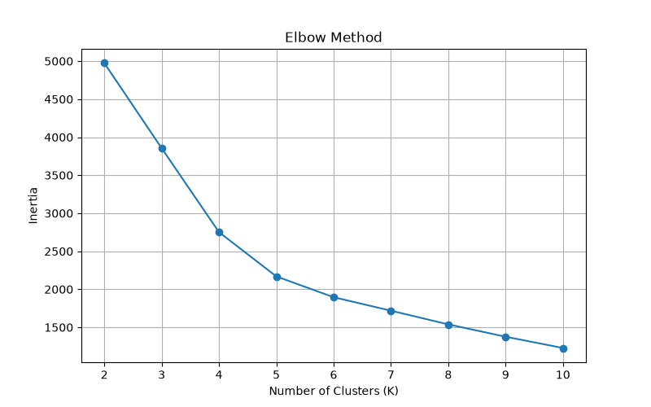
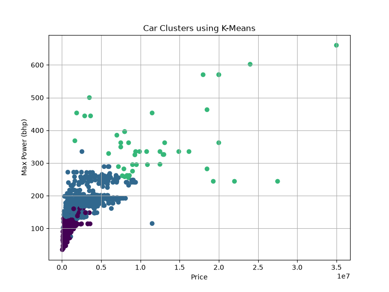
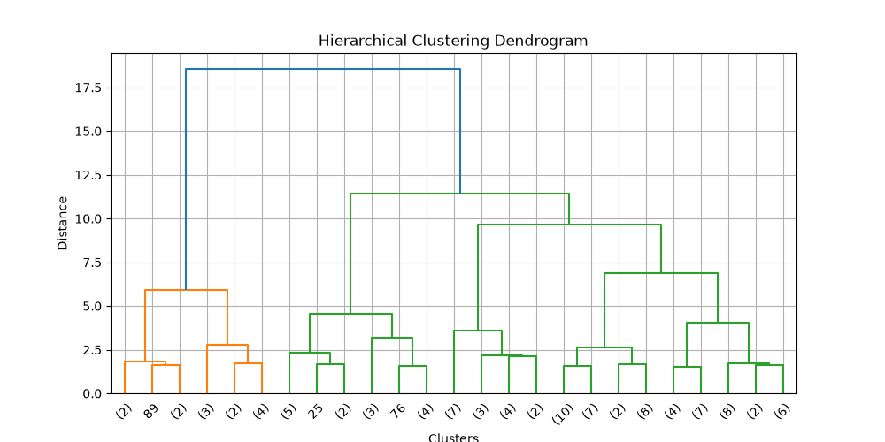

# Car Segmentation Using K-Means and Hierarchical Clustering

## 1. Introduction

This micro project applies unsupervised machine learning techniques to a real-world car dataset. The aim is to group similar cars based on their characteristics such as price, kilometers driven, engine capacity and maximum power.

The project uses K-Means clustering and Hierarchical Clustering.

## 2. Aim

To group similar cars into different clusters using K-Means and Hierarchical Clustering techniques.

## 3. Dataset

The project uses the **Car Details V4** dataset.

The dataset contains information about different cars, including:

- Price
- Year
- Kilometer
- Fuel Type
- Transmission
- Engine
- Max Power
- Max Torque
- Seating Capacity
- and other car-related attributes.

## 4. Features Used

For clustering, the following four numerical features were selected:

- Price
- Kilometer
- Engine
- Max Power

The Engine and Max Power values were converted into numerical form during preprocessing.

## 5. Algorithms Used

### K-Means Clustering

K-Means is an unsupervised learning algorithm that divides the data into a specified number of clusters based on similarity.

### Hierarchical Clustering

Hierarchical clustering creates a hierarchy of clusters. Agglomerative clustering is used in this project, where individual data points are progressively merged into larger clusters.

## 6. Methodology

1. Load the car dataset.
2. Preprocess the Engine and Max Power columns.
3. Remove rows containing missing values in the selected features.
4. Select Price, Kilometer, Engine and Max Power.
5. Standardize the selected features using StandardScaler.
6. Apply K-Means for different values of K.
7. Use the Elbow Method to analyze the suitable number of clusters.
8. Perform final K-Means clustering.
9. Apply hierarchical clustering using Ward linkage.
10. Visualize the results using graphs.

## 7. Results

The project produces three main visualizations:

### Elbow Method

The Elbow Method is used to analyze the inertia values for different numbers of clusters.



### K-Means Clustering

The K-Means result shows the grouping of cars based on Price and Max Power.



### Hierarchical Clustering

The dendrogram shows the hierarchical relationship between the selected sample of cars.



## 8. Applications

Car segmentation can be useful for:

- Car recommendation systems
- Automobile market analysis
- Customer segmentation
- Used-car analysis
- Identifying groups of similar vehicles

## 9. Technologies Used

- Python
- Pandas
- NumPy
- Matplotlib
- Scikit-learn
- SciPy

## 10. How to Run

Install the required Python libraries:

```bash
pip install pandas numpy matplotlib scikit-learn scipy